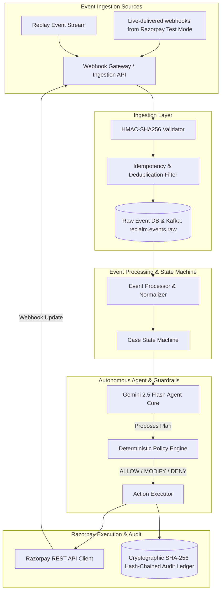
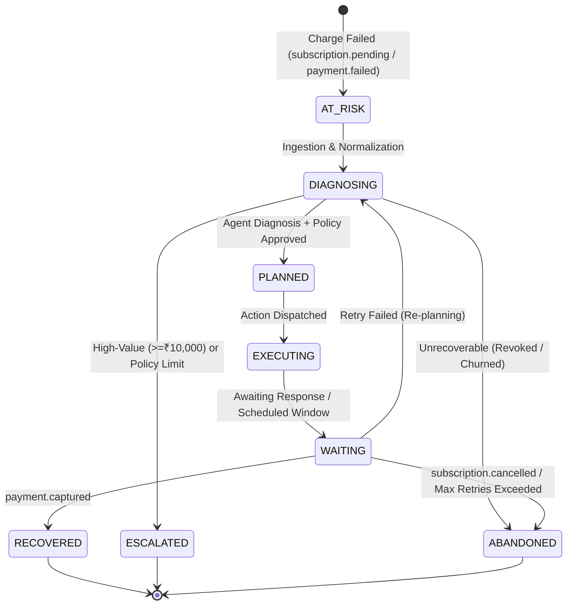
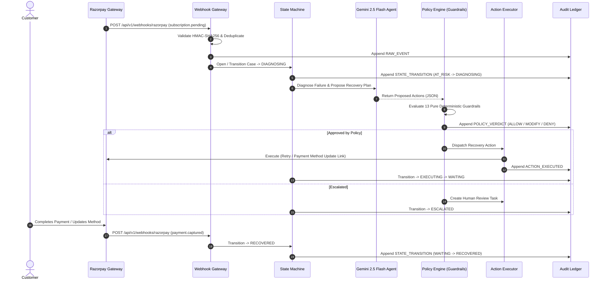

# RECLAIM — System Architecture & Design

> **An event-driven Spring Boot revenue recovery system with deterministic guardrails and cryptographic audit ledgering.**

---

## 1. High-Level Component Flow

---

## 2. Recovery Case State Machine

---

## 3. End-to-End Recovery Sequence

---

## 4. Supported Recovery Actions (Razorpay-Aligned)

| Action | When Proposed | Razorpay Workflow | Guardrails Checked |
|---|---|---|---|
| `SCHEDULE_RETRY` | Transient failures (e.g. balance, downtime) | `/v1/subscriptions/{id}/charge` | `MAX_RETRIES`, `MIN_RETRY_INTERVAL`, `DOWNTIME_BLOCK` |
| `REQUEST_PAYMENT_METHOD_UPDATE` | Card expired / mandate invalid | `/v1/payment_links` update link | `PER_CASE_SPEND_CAP`, `IDEMPOTENCY_GUARD` |
| `SEND_CUSTOMER_NUDGE` | Customer intervention needed | Context-aware outreach | `QUIET_HOURS`, `MAX_CONTACTS`, `CONTACT_COOLDOWN` |
| `ESCALATE` | High-value ($\ge$ ₹10k) or risk boundary | Human task queue | `HIGH_VALUE_APPROVAL` |
| `CLOSE_CASE` | Revoked mandate / explicit cancellation | Immediate termination | `TERMINAL_STATE_LOCK`, `CANCELLED_SUB_LOCK` |

---

## 5. Architectural Invariants

1. **One Code Path:** Replay test events and live webhooks traverse the identical HTTP endpoint, HMAC verifier, state machine, and policy engine.
2. **Deterministic Precedence:** The LLM cannot override retry caps, quiet hours, spend limits, or terminal state locks.
3. **Cryptographic Tamper-Evidence:** Every entry hash satisfies `H_n = SHA-256(H_{n-1} || canonical_json(payload))`.
