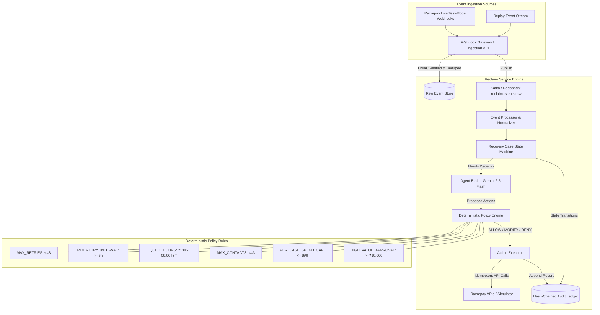
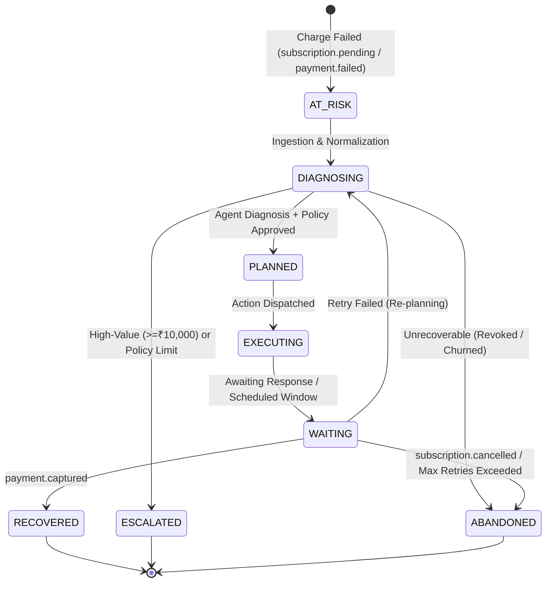
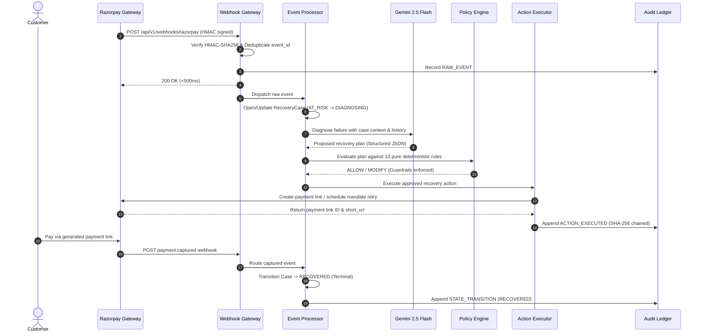

# RECLAIM — System Architecture Specification

## 1. High-Level Architecture Map

---

## 2. Recovery Case State Machine

---

## 3. End-to-End Recovery Sequence

---

## 4. Architectural Honesty & Key Decisions

1. **One Code Path, Two Event Sources:** Live webhooks and batch replay both enter via the identical `/api/v1/webhooks/razorpay` endpoint using real HMAC signatures.
2. **Pure Policy Layer:** The LLM produces proposals; the policy engine deterministically enforces limits (caps, quiet hours, spend budgets, kill-switches).
3. **Cryptographic Tamper-Evidence:** Every single lifecycle step is appended to a SHA-256 hash-chained ledger (`entry_hash = sha256(prev_hash || canonical_payload)`).
4. **Degraded Mode Resilience:** If the LLM experiences latency, rate limits, or 5xx outages, a Resilience4j circuit breaker trips and automatically falls back to the deterministic rules-only baseline (`RulesRecoveryEngine`) without dropping recoveries.
