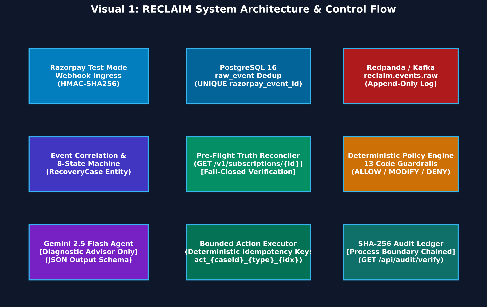
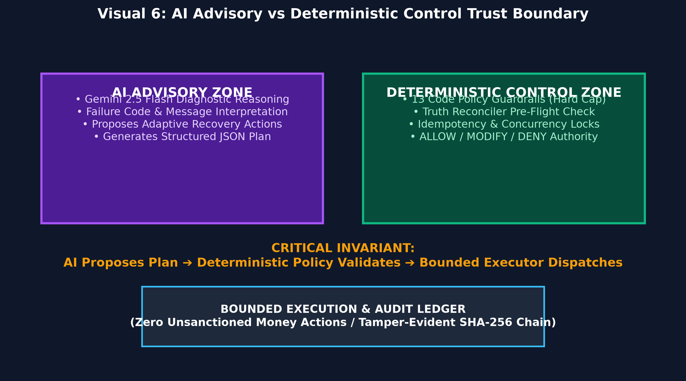
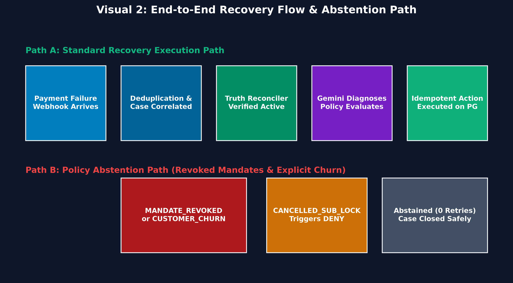
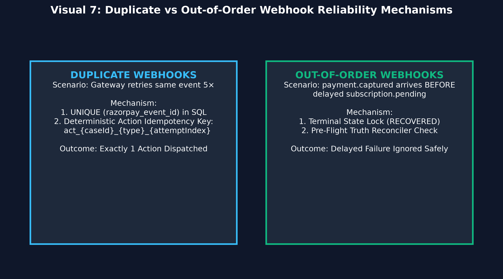
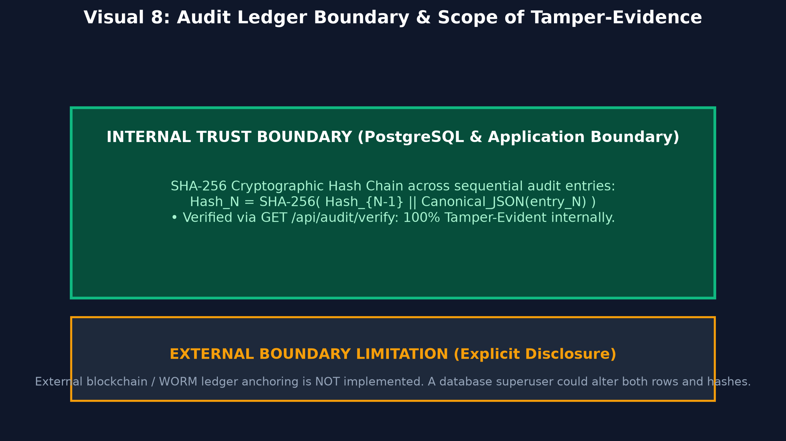

# RECLAIM

> **An event-driven AI recovery control plane for failed recurring payments.**

[-success?style=flat-square)](https://github.com/Sadiq8064/reclaim-agent)
[](https://github.com/Sadiq8064/reclaim-agent)
[](https://github.com/Sadiq8064/reclaim-agent)
[](https://github.com/Sadiq8064/reclaim-agent)

---

## 🎯 The Problem

Recurring auto-debit payments fail regularly in subscription commerce. When a billing invoice is declined, the underlying cause is rarely uniform:

- **Transient Bank Downtime:** The issuing bank rail is degraded during the auto-debit window.
- **Temporary Insufficient Funds:** Balance is low on billing day, but expected to replenish on salary day.
- **Expired Payment Methods:** The customer's mandate card expired, requiring a self-service update link.
- **Revoked Mandates & Explicit Churn:** The customer intentionally revoked permissions or cancelled their service.
- **Delayed Ingestion:** The payment was already captured via an alternate link, but the failure event arrived late.

### Why Blind Retries Fail
Traditional dunning engines use static intervals (e.g., *retry every 24 hours up to 3 times*). Blind retries burn through retry limits during active bank downtime, irritate customers with midnight SMS spam, trigger payment rail penalties on revoked mandates, and charge accounts based on stale state.

---

## ⚡ What RECLAIM Does

RECLAIM coordinates the entire payment recovery lifecycle through an asynchronous control loop:

```text
Detect ──► Correlate ──► Verify Truth ──► Diagnose ──► Guard ──► Execute ──► Observe ──► Stop
```

1. **Detects** payment failures and downtime events from Razorpay Test Mode webhooks.
2. **Correlates** related events into persistent, stateful `RecoveryCase` entities.
3. **Verifies Live Truth** before touching money by polling the gateway API for real-time subscription status.
4. **Diagnoses & Recommends** contextual recovery actions via Google Gemini 2.5 Flash.
5. **Guards Every Action** against 13 pure deterministic code rules and spend limits.
6. **Executes Idempotently** using deterministic action keys to guarantee single-execution semantics.
7. **Observes Trajectories** in an 8-state finite state machine with a cryptographic SHA-256 audit log.
8. **Stops Honestly** when cases are unrecoverable, revoked, or non-compliant.

---

## 🏛️ The 30-Second Architecture



- **Ingress (`WebhookGateway.java`):** Ingests Razorpay webhooks, verifies HMAC signatures, and deduplicates on `razorpay_event_id`.
- **Event Streaming (Redpanda / Kafka):** Decouples burst webhook ingestion from downstream AI diagnostic latency via an append-only distributed log.
- **State Machine (`StateMachine.java`):** Tracks case lifecycles across 8 discrete states (`AT_RISK` $\rightarrow$ `DIAGNOSING` $\rightarrow$ `PLANNED` $\rightarrow$ `EXECUTING` $\rightarrow$ `WAITING` $\rightarrow$ `RECOVERED` / `ABANDONED` / `ESCALATED`).
- **Truth Reconciler (`TruthReconciler.java`):** Queries live Razorpay API (`GET /v1/subscriptions/{id}`) to verify current truth before executing any action.
- **Policy Engine (`PolicyEngine.java`):** 13 deterministic code guardrails governing retry intervals, spend limits, TRAI quiet hours, and cancellation locks.
- **AI Advisory (`GeminiAgentClient.java`):** Prompts Gemini 2.5 Flash for diagnosis and plan recommendations with structured JSON schema outputs.
- **Bounded Executor (`ActionExecutor.java`):** Dispatches idempotent requests (`SCHEDULE_RETRY`, `REQUEST_PAYMENT_METHOD_UPDATE`, `CREATE_PAYMENT_LINK`, `SEND_CUSTOMER_NUDGE`).
- **Audit Ledger (`AuditLedger.java`):** Computes tamper-evident SHA-256 hash chains across all state transitions within the database boundary.

---

## 🧠 Core Philosophy: AI is Advisory, Not Authoritative



In RECLAIM, non-deterministic AI models have **zero direct execution authority**:

| What the AI CAN Do | What the AI CANNOT Do |
|---|---|
| Interpret complex decline error strings and bank codes | Directly charge cards or trigger money movements |
| Synthesize customer attempt history and salary cycles | Override retry limits or spend caps |
| Recommend optimal multi-step recovery plans | Bypass TRAI quiet hours (21:00–09:00 IST) |
| Propose adaptive timing around bank downtime | Act on inactive or cancelled subscriptions |

> **The Architectural Rule:** *The AI proposes recovery plans; deterministic code decides whether any action may execute.*

---

## 🔄 A Recovery Case from Start to Finish



### Path A: Active Recovery Lifecycle
1. **Failure Event:** A recurring subscription debit fails on Razorpay (`INSUFFICIENT_FUNDS`).
2. **Webhook Ingress:** Webhook arrives at `POST /api/v1/webhooks/razorpay`, HMAC is verified, and the event is written to `raw_event` and published to Kafka.
3. **Correlation:** `EventProcessor` correlates the event to `RecoveryCase`, transitioning state to `DIAGNOSING`.
4. **Pre-Flight Truth Check:** `TruthReconciler` confirms the subscription is active and unpaid on Razorpay.
5. **AI Diagnosis:** Gemini 2.5 Flash analyzes the error and recommends a timed retry aligned with the customer's upcoming salary cycle.
6. **Policy Evaluation:** `PolicyEngine` evaluates the action against 13 guardrails (`ALLOW`).
7. **Execution:** `ActionExecutor` dispatches the scheduled retry with a unique idempotency key.
8. **Settlement:** When the subsequent retry succeeds, a `payment.captured` webhook transitions the case to `RECOVERED`.

### Path B: Intentional Policy Abstention
1. **Revocation Event:** An auto-debit fails with `MANDATE_REVOKED` or customer requests cancellation.
2. **Deterministic Check:** `PolicyEngine` matches `CANCELLED_SUB_LOCK` / `TERMINAL_STATE_LOCK`.
3. **Immediate STOP:** The policy issues an unconditional `DENY`. The case transitions to `ABANDONED` with **0 retries fired and 0 spam nudges sent**.

---

## 🛡️ Built for Payment-Event Reliability



Distributed payment systems experience delivery quirks. RECLAIM explicitly separates and defends against two distinct reliability challenges:

### 1. Duplicate Events (At-Least-Once Delivery)
- **Challenge:** Gateway delivers identical webhooks multiple times concurrently.
- **Protection:** Database unique constraint on `razorpay_event_id` + deterministic action idempotency keys (`act_{caseId}_{type}_{attemptIdx}`).
- **Verification:** `ConcurrentDuplicateAndOutOfOrderWebhookTest` fires 5 concurrent identical webhooks $\rightarrow$ exactly 1 event and 1 action are processed.

### 2. Out-of-Order Events (Asynchronous Race Conditions)
- **Challenge:** A `payment.captured` event arrives *before* a delayed `subscription.pending` failure event.
- **Protection:** Terminal state locks + `TruthReconciler` fail-closed verification. Once a case is settled as `RECOVERED`, delayed failure webhooks are rejected.
- **Verification:** `EventOrderingAndShuffleTest` validates that shuffled event sequences converge safely without duplicate recovery effects.

---

## 🔍 Truth Before Action (Truth Reconciler)

Webhooks describe the past. Before any money-moving recovery action is executed, `TruthReconciler.java` queries the live Razorpay API:

$$\text{Action Safe} \iff \text{Razorpay Status is ACTIVE } \land \text{ Invoice is UNPAID}$$

- If Razorpay reports the subscription is **inactive or cancelled**, pending actions are aborted and the case is closed.
- If the invoice is **already paid**, the case transitions to `RECOVERED` immediately.
- If the Razorpay API is **unreachable**, the reconciler fails closed (`safeToProceed = false`), postponing execution rather than risking an unverified double-charge.

---

## 📊 Does the AI Actually Help? (20-Seed Benchmark)

We benchmarked RECLAIM across **20 random seeds × 300 cases (6,000 total simulated subscription failures)** against three baseline arms:

- **B0 (Do Nothing):** No recovery action taken.
- **B1 (Fixed Retries):** Blind retries every 24 hours up to 3 attempts.
- **B2 (Deterministic Rules):** Static heuristic rules (immediate retry on declines, 6h wait on downtime, generic payment link on expired cards).
- **B3 (RECLAIM Agent):** Gemini 2.5 Flash diagnostic reasoning bounded by deterministic policy guardrails.

### Benchmark Comparison Table

| Metric | B0 (Do Nothing) | B1 (Fixed Retries) | B2 (Deterministic Rules) | B3 (RECLAIM Agent) |
|---|---|---|---|---|
| **20-Seed Mean Net Recovered** | ₹0.00 | ₹496,210.45 | ₹634,119.26 | **₹653,788.99** |
| **Standard Deviation (σ)** | — | ±₹14,210.00 | ±₹11,450.30 | **±₹12,180.50** |
| **Mean Incremental Lift over B2** | — | — | Baseline | **+₹19,669.73 Net Lift** |
| **Incremental Lift Range [Min, Max]**| — | — | — | **[+₹15,810.26, +₹23,933.73]** |
| **B3 Win / Loss / Tie Count** | — | 20 / 0 / 0 | Baseline | **20 Wins / 0 Losses / 0 Ties\*** |
| **Mean Actions per Case** | 0.0 | 4.48 | 1.57 | **1.41** |
| **Wasted Retries per 300** | 0 | 297 | 0 | **0** |
| **Customer Churn Events Triggered** | 0 | 99 | 24 | **0** |

*\*Statistical Context: The 20/20 win-rate tests stability against sampling variation from our synthetic generator under identical modeled conditions. It demonstrates that the agent consistently outperforms rigid 24h clocks when multi-signal delays (bank downtime, salary cycles) exist in the data model. It does not claim universal superiority across all real-world merchant portfolios.*


---

## 💰 AI Cost versus Incremental Value


### Transparent Token Accounting (Per 300 Cases)
- **Model:** Google Gemini 2.5 Flash (Standard Interactive Tier)
- **Reference Rates:** $0.30 per 1M prompt tokens, $2.50 per 1M billable output/thinking tokens
- **Inference Usage:** 180,000 prompt tokens ($0.054) + 60,000 output tokens ($0.150) = **$0.204 ≈ ₹17.15 total** (~**₹0.057 per case**)

### Incremental ROI Calculation
$$\text{Incremental AI ROI} = \frac{\text{Mean Incremental Recovery Lift (B3 } - \text{ B2)}}{\text{Total AI Inference Cost}} = \frac{\text{₹19,669.73}}{\text{₹17.15}} \approx \mathbf{1,146\times}$$

*Framing: For every ₹1 spent on Gemini 2.5 Flash inference, RECLAIM produced approximately ₹1,146 of incremental recovery lift over the deterministic baseline under this evaluation.*

---

## 🚫 When RECLAIM Intentionally Does Nothing


A core benchmark metric is knowing when to abstain. Across each 300-case batch:
- **51 total cases were intentionally abstained from** (0 automated retries fired).
- **27 `MANDATE_REVOKED` cases:** `CANCELLED_SUB_LOCK` stopped retries immediately, eliminating pointless charge attempts.
- **24 `CUSTOMER_CHURNED` cases:** Recovery contacts were suppressed for **24 unique customers**, avoiding the churn penalty triggered by B2's blind SMS outreach.

---

## 🧪 Real Engineering Evidence (27/27 Tests Green)

The test suite validates invariants across all 4 Maven modules:

```text
[INFO] Results:
[INFO] Tests run: 27, Failures: 0, Errors: 0, Skipped: 0
```

- **`ConcurrentDuplicateAndOutOfOrderWebhookTest`:** Validates 5 concurrent duplicate threads and delayed webhook precedence.
- **`EventOrderingAndShuffleTest`:** Validates shuffled event arrival sequences and terminal state locks.
- **`TruthReconcilerTest`:** Asserts fail-closed halt on inactive subscriptions and safe approval on active subscriptions.
- **`PolicyEngineTest`:** 13 unit tests verifying every deterministic policy guardrail independently.
- **`AuditLedgerTest`:** Validates SHA-256 hash chaining and tamper detection.
- **`ExecutorResilienceTest`:** Tests Resilience4j circuit breaker fallback to heuristic rules during AI timeouts.
- **`ReclaimRealLoopE2ETest`:** End-to-end integration test from webhook ingestion to database state settlement.

---

## ⛓️ Audit Trail & Trust Boundary



- **Cryptographic Hash Chain:** Every state transition computes $\text{Hash}_N = \text{SHA-256}(\text{Hash}_{N-1} \parallel \text{Canonical\_JSON}(\text{entry}_N))$.
- **Tamper Evidence:** Any direct SQL modification breaks the hash chain, detected immediately via `GET /api/audit/verify`.
- **Honest Boundary Limitation:** The ledger is tamper-evident **within the RECLAIM application/database boundary**. External anchoring (e.g. to a public blockchain or WORM storage) is not implemented.

---

## 🏗️ What is Real vs Modeled?

| Component | Status | Description |
|---|---|---|
| **Spring Boot Backend** | Real Implementation | Java 17 + Spring Boot 3.3.x core service running on port 8080. |
| **PostgreSQL Database** | Real Implementation | PostgreSQL 16 container with ACID transactions and JSONB storage. |
| **Redpanda Event Broker** | Real Implementation | Kafka-compatible distributed event stream on `reclaim.events.raw`. |
| **Policy Engine** | Real Implementation | 13 deterministic code guardrails in `PolicyEngine.java`. |
| **Truth Reconciler** | Real Implementation | Pre-flight API verification in `TruthReconciler.java`. |
| **Razorpay Test Mode** | Real Integration | Official Razorpay sandbox APIs for webhooks and subscription charging. |
| **Audit Ledger** | Real Implementation | SHA-256 hash-chained ledger verifiable via REST endpoint. |
| **Test Suite** | Real Implementation | 27 automated unit, integration, and concurrency tests. |
| **Evaluation Dataset** | Modeled / Synthetic | 300 calibrated cases modeled across common recurring failure modes. |
| **Conversion Assumptions** | Modeled / Synthetic | Conversion probabilities in benchmark represent modeled data assumptions. |

---

## 📦 Technology Choices

| Technology | Role in RECLAIM | Architectural Rationale |
|---|---|---|
| **Java 17 / 21 & Spring Boot 3** | Core Control Plane | Strong type safety, transactional integrity (`@Transactional`), and enterprise concurrency. |
| **PostgreSQL 16** | Relational & JSONB Store | ACID state management for cases with JSONB flexibility for webhook payloads. |
| **Redpanda / Kafka** | Distributed Event Streaming | Decouples webhook ingestion (10ms) from AI reasoning latency and buffers burst traffic. |
| **Google Gemini 2.5 Flash** | AI Diagnostic Advisory | Fast latency (~800ms) and structured JSON schema outputs at low inference cost. |
| **Resilience4j** | Circuit Breaker & Fallback | Trips on AI outage/latency to fall back to heuristic rules (`degraded_mode=true`). |
| **SHA-256 Cryptography** | Audit Ledger Integrity | Cryptographic hash chaining for process-boundary tamper evidence. |

---

## ▶️ Run Locally

### Prerequisites
- Docker & Docker Compose
- Java 17+ & Maven 3.9+

```bash
# 1. Start PostgreSQL & Redpanda Kafka broker
docker compose up -d

# 2. Run clean test suite (27 unit & integration tests)
mvn clean test

# 3. Run the 20-seed evaluation benchmark
make eval

# 4. Start the Spring Boot Web Command Center
mvn -pl reclaim-app spring-boot:run
```
Access the Command Center dashboard at `http://localhost:8080`.

---

## ⚠️ Scope & Limitations

1. **Synthetic Evaluation Boundary:** The evaluation dataset is synthetic. Real-world recovery rates will vary across merchant verticals.
2. **Audit Ledger Scope:** Tamper-evidence is enforced within the application/PostgreSQL boundary. External blockchain anchoring is not implemented.
3. **Sandbox API Roundtrip:** Truth Reconciler pre-flight checks introduce a ~100ms HTTP API roundtrip to the Razorpay sandbox prior to executing money actions.

---

## 🗺️ Repository Structure

```text
reclaim/
├── reclaim-app/         # Core Spring Boot backend, state machine, policy engine, reconciler
├── reclaim-replay/      # Synthetic batch generator (datasets/batch-300.json)
├── reclaim-eval/        # 4-arm evaluation benchmark engine (ReportGenerator.java)
├── docs/                # Comprehensive architecture and evaluation documentation
│   └── images/          # Analytical engineering diagrams (v1 through v9)
├── datasets/            # Calibrated 300-case test scenario datasets
├── docker-compose.yml   # PostgreSQL 16 & Redpanda broker configuration
├── Makefile             # One-command build, test, and evaluation targets
├── ARCHITECTURE.md      # Deep architectural specifications and trust boundaries
└── EVALUATION.md        # Complete 20-seed benchmark report and statistical tables
```

---

## 💡 Closing Statement

> *RECLAIM explores a simple premise: AI can significantly improve recovery diagnosis and timing, but in payment systems, intelligence must operate strictly inside explicit truth, policy, idempotency, and execution boundaries.*
